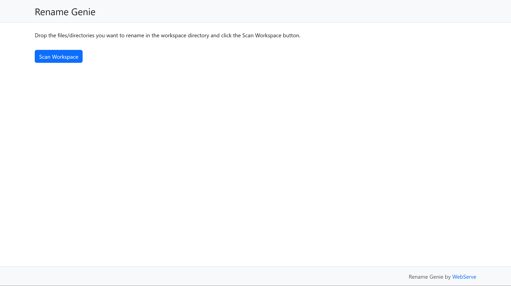
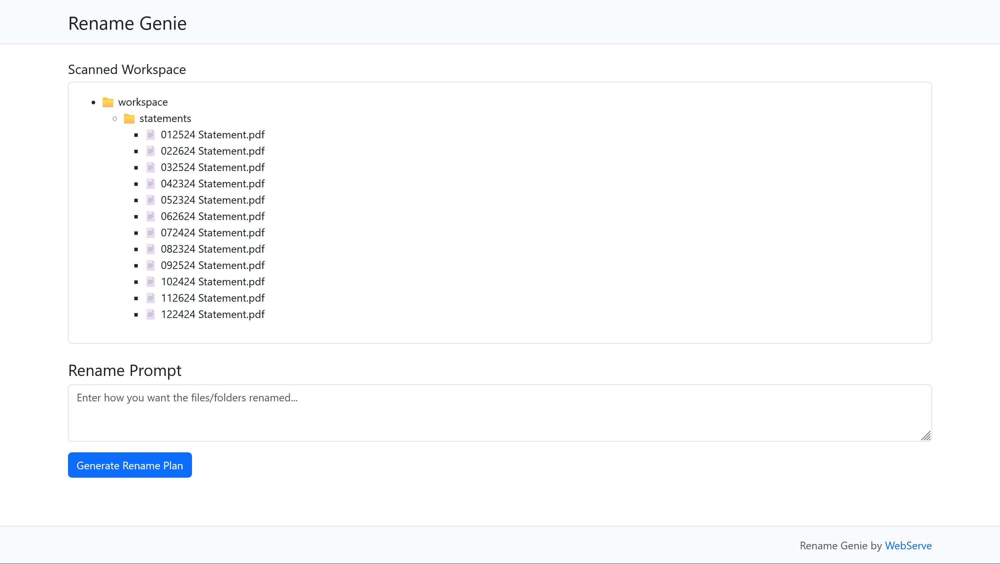
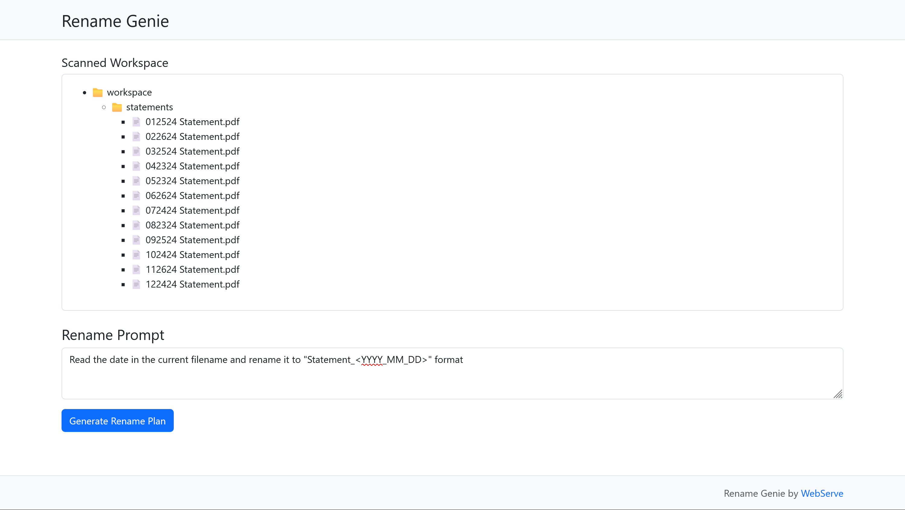
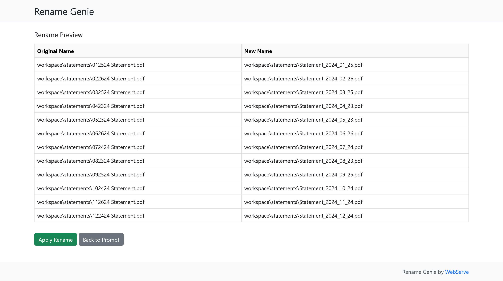
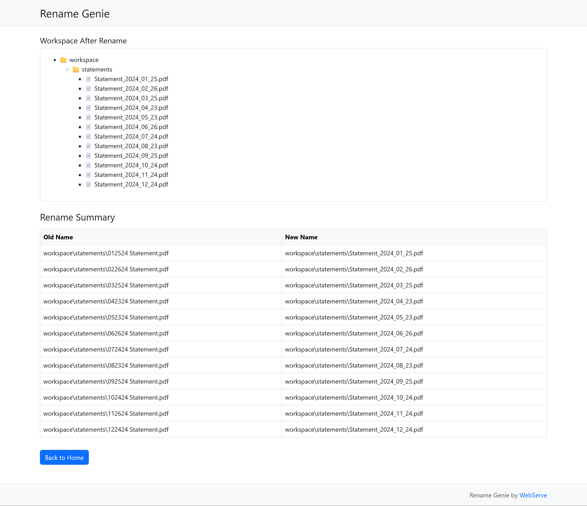

# Rename Genie

## Description
- A simple but powerful way to bulk rename your files and directories using AI powered by LLM

## Tech Stack
- Tech Stack: Python FastAPI, Bootstrap, HTML, CSS, JS
- WebApp Architecture: Postback
- LLM Platform: OpenRouter

### Screenshots

Homepage 

Scanned Workspace 

Scanned Workspace and Prompt 

Preview before Apply 

After Apply Summary 

## Environment Setup

### Create a virtual environment
```
# For Unix environment
python -m venv .venv
source .venv/bin/activate
```

```
# For Windows environment
python -m venv .venv
.venv\Scripts\activate
```

### Install dependencies
```
pip install -r requirements.txt
```

### Create the config file
```
cp config.yaml.example config.yaml
```
Set your OpenRouter API key and OpenRouter model in config.yaml

### Running the app
```
python app/main.py
```

Application will start by default on http://localhost:8000

### Setup the workspace directory
Drop the files and folders you want to rename in the `workspace` directory.

